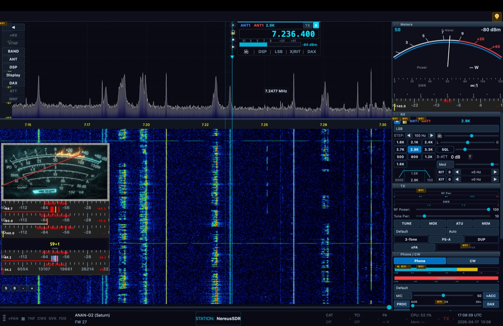

# NereusSDR

**A cross-platform SDR console for OpenHPSDR radios**

> ⚠ **NereusSDR v0.1.x alpha builds withdrawn**
>
> An unforeseen issue was identified in the v0.1.x alpha builds that needs
> to be addressed before further public distribution. All v0.1.x binaries
> have been withdrawn from the Releases page. **If you installed a v0.1.x
> build, please uninstall it.** A fresh v0.2.0 will follow once the work
> is complete; we'll announce it here when it's ready.
>
> — J.J. Boyd ~ KG4VCF

[](https://github.com/boydsoftprez/NereusSDR/actions/workflows/ci.yml)
[](https://www.gnu.org/licenses/gpl-3.0)
[](https://en.cppreference.com/w/cpp/20)
[](https://www.qt.io/)

NereusSDR is a C++20/Qt6 port of [Thetis](https://github.com/ramdor/Thetis) — the canonical OpenHPSDR / Apache Labs SDR console, itself descended from FlexRadio PowerSDR — carrying its radio logic, DSP integration, and feature set forward to a native cross-platform codebase (macOS, Linux, Windows) with a Qt-based GUI. The Thetis contributor lineage (FlexRadio Systems, Doug Wigley W5WC, Richard Samphire MW0LGE, and the wider OpenHPSDR community) is preserved per-file in source headers and summarized in [docs/attribution/THETIS-PROVENANCE.md](docs/attribution/THETIS-PROVENANCE.md). Distributed under GPLv3 (root [LICENSE](LICENSE)), elected under the "or later" grant in upstream Thetis source-file headers (Thetis is GPLv2-or-later). A verbatim copy of GPLv2 ships at [docs/attribution/LICENSE-GPLv2](docs/attribution/LICENSE-GPLv2) for reference, since several WDSP and ChannelMaster source files explicitly reference v2.



---

## Supported Radios

Works with any radio implementing OpenHPSDR Protocol 1 or Protocol 2:

- **Apache Labs ANAN line** — ANAN-G2 (Saturn), ANAN-7000DLE, ANAN-8000DLE, ANAN-200D, ANAN-100D, ANAN-100, ANAN-10E
- **Hermes Lite 2**
- **All OpenHPSDR Protocol 1 radios** — Metis, Hermes, Angelia, Orion, Orion MkII
- **All OpenHPSDR Protocol 2 radios**

---

## Releases & Installation

Pre-built binaries for Linux (AppImage, x86_64 + aarch64), macOS (DMG, Apple
Silicon + Intel), and Windows (NSIS installer + portable ZIP, x64) are
published as GitHub Releases:

**<https://github.com/boydsoftprez/NereusSDR/releases>**

All artifacts are GPG-signed (`KG4VCF`) via `SHA256SUMS.txt.asc`. To verify:

```bash
gpg --keyserver keyserver.ubuntu.com --recv-keys KG4VCF
gpg --verify SHA256SUMS.txt.asc SHA256SUMS.txt
sha256sum -c SHA256SUMS.txt
```

> **Alpha builds:** until Apple Developer ID and Authenticode certificates
> are obtained, macOS users will need to right-click → Open the DMG on first
> launch, and Windows users will see a SmartScreen warning to click through.
> Linux is unaffected. See the per-release notes for details.

---

## Current Status

**Phase 3I complete — Radio Connector & Radio-Model Port: full ANAN/Hermes P1 family now supported end-to-end.** Every OpenHPSDR Protocol 1 radio in the ANAN/Hermes family (Hermes Lite 2, ANAN-10/10E/100/100B/100D/200D, Metis) now discovers, connects, streams I/Q through the existing WDSP demod chain, and persists per-radio settings — identical behaviour to how ANAN-G2 on Protocol 2 works today. 25 GPG-signed commits in PR #12. Smoke-test checklist at [`docs/debugging/phase3i-smoke-test.md`](docs/debugging/phase3i-smoke-test.md). Design at [`docs/architecture/phase3i-radio-connector-port-design.md`](docs/architecture/phase3i-radio-connector-port-design.md), plan at [`docs/architecture/phase3i-radio-connector-port-plan.md`](docs/architecture/phase3i-radio-connector-port-plan.md).

Phase 3I shipped:
- `HPSDRModel` and `HPSDRHW` enums ported 1:1 from mi0bot/Thetis `enums.cs` (integer values preserved including the 7..9 reserved gap)
- `BoardCapabilities` `constexpr` registry — pure data, one entry per `HPSDRHW`, 20+ test invariants
- `P1RadioConnection` with full ep2 compose + ep6 parse, loopback integration test via `P1FakeRadio`, 2 s watchdog + bounded reconnection state machine
- `P2RadioConnection` audited to read `BoardCapabilities`; recognises `SaturnMKII`, `ANAN_G2_1K`, `AnvelinaPro3`
- `RadioDiscovery` rewritten with 6 tunable timing profiles (mi0bot `clsRadioDiscovery.cs` pattern)
- `ConnectionPanel` expanded into a full Thetis `ucRadioList.cs` port — 8 sortable columns, saved-radio persistence keyed by MAC, manual-add dialog ported from `frmAddCustomRadio.cs`, auto-reconnect on launch
- `HardwarePage` with 9 capability-gated nested tabs mirroring Thetis Setup.cs Hardware Config (Radio Info · Antenna/ALEX · OC Outputs · XVTR · PureSignal · Diversity · PA Calibration · HL2 I/O Board · Bandwidth Monitor), with per-MAC settings persistence
- One docs-era bug fix: the legacy `BoardType::Griffin=2` slot was a mistake; mi0bot's `enums.cs:392` clarifies slot 2 is `HermesII` (ANAN-10E / 100B)
- `RadioConnectionError` enum replaces string-only `errorOccurred` signal (9 structured codes)

Deferred (see `docs/architecture/phase3i-verification.md` + design §9): TX IQ producer, PureSignal feedback DSP, HL2 `IoBoardHl2` I2C-over-ep2 wire encoding (Phase 3L — lives in closed `ChannelMaster.dll`), full bandwidth-monitor port, TCI, RedPitaya, sidetone generator, firmware flasher.

**Phase 3G-8 complete — RX1 Display parity: Setup → Display pages fully wired to the renderer.** NereusSDR connects to an ANAN-G2 (Orion MkII) via Protocol 2, receives raw I/Q data, demodulates audio through WDSP, renders a live GPU-accelerated spectrum + waterfall with VFO tuning (CTUN mode), has a full UI skeleton with 12 applets, 150+ control widgets, a complete meter system with 31 item types, and — as of 3G-8 — a fully wired Display setup category where every Spectrum Defaults / Waterfall Defaults / Grid & Scales control routes through to the renderer live on both the QPainter fallback path and the QRhi/Metal GPU path. Per-band grid state persists across all 14 bands (160m–6m + GEN + WWV + XVTR).

**Phase 3G-6 (one-shot)** shipped 2026-04-12 as PR #2 — 40 GPG-signed commits across 7 execution blocks on `feature/phase3g6-oneshot`:

- **Block 1** — rendering plumbing + Thetis filter rule (`MeterManager.cs:31366-31368` ported into `MeterWidget::shouldRender()`)
- **Block 2** — container surface (lock, hide title, minimises, auto height, hide-when-RX-unused, highlight, duplicate) + `NeedleItem` calibration-driven paint rewrite so the ANANMM gauge face renders
- **Block 3** — `ContainerSettingsDialog` rewrite to Thetis's 3-column layout (Available / In-use / Properties), snapshot+revert on Cancel, container-switch dropdown, footer Save/Load/MMIO buttons
- **Block 4** — 31 per-item property editors built in parallel by 4 subagents (zero manual fixups, ~155 fields exposed), `QScrollArea` wrapping
- **Block 5** — MMIO Multi-Meter I/O subsystem: 4 transport workers (UDP listener, TCP listener, TCP client, Serial), JSON/XML/RAW format parsers, dedicated worker `QThread`, XML persistence under `AppSettings/MmioEndpoints/<guid>/*`, endpoint manager dialog, variable picker popup, `MeterPoller` branch reading bound values at 10 fps. Section 6 of the plan was rewritten mid-block after a Thetis Explore agent confirmed the original draft's per-variable parse-rule taxonomy didn't exist in Thetis (real Thetis is endpoint-centric with format-driven discovery)
- **Block 6** — `Containers → Edit Container ▸` submenu populated dynamically from `ContainerManager::allContainers()`, alphabetized by notes, click-to-edit per container regardless of dock mode. Reset Default Layout finally functional.
- **Block 7** — polish + docs: 720 lines of legacy `buildXItemEditor` dead code removed, `lcMmio` registered in `LogManager`, copy/paste item settings clipboard with type-tag gating, container-dropdown auto-commit on switch, `CHANGELOG` + `CLAUDE.md` phase table flipped to Complete, debug-handoff marked Resolved.

**Phase 3G-7 polish** shipped 2026-04-12 on `feature/phase3g7-polish` — 4 GPG-signed commits on top of 3G-6:

- **`25a7819`** `feat(meters)` — Add 42 read-back getters across 5 MeterItem subclasses (TextOverlay, Rotator, FilterDisplay, Clock, VfoDisplay) so each item's property editor populates fully on dialog open. Wires each editor's `setItem()` to the new accessors.
- **`8774b7c`** `fix(meters)` — Preserve MMIO bindings across all 4 dialog clone paths in `ContainerSettingsDialog.cpp`. Investigation showed the user-visible "binding lost on Apply" bug was a 4-site clone leak in one file, not the 30-subclass serialize sweep the original handoff proposed. Side-channel fix: `populateItemList`, `applyToContainer`, `takeSnapshot`/`revertFromSnapshot`, and the preset clone loop now copy `(mmioGuid, mmioVariable)` directly around the text round-trip via a parallel `QVector<QPair<QUuid, QString>>` snapshot.
- **`41c7031`** `feat(editor)` — Wrap `NeedleItemEditor`'s 17 needle-specific fields plus the calibration table in 5 `QGroupBox` sections (Needle / Geometry / History / Power / Calibration). Layout-only refactor; member pointers and connect lambdas unchanged.
- **`33e5ba0`** `docs(3G-7)` — CHANGELOG flipped to complete with per-item narrowings documented; handoff doc gains a 17-item "Outstanding work after 3G-7" section so each deferred item (MMIO disk persistence, smoke test, editor width sweep, ButtonBox sub-editor, 10 phantom feature ports) can be filed as its own GitHub issue.

Items A and B both turned out dramatically smaller than the original handoff scoped — see the handoff doc and CHANGELOG for the per-item narrowings. Items D, E, F and the phantom feature ports are deferred to follow-up work; full list at `docs/architecture/phase3g7-polish-handoff.md` § "Outstanding work after 3G-7".

**Phase 3G-8 — RX1 Display parity** shipped 2026-04-12 on `feature/phase3g8-rx1-display-parity` — 10 GPG-signed code commits + 3 doc-amend prep commits, off `main` (after 3G-7 merge). Brings the `Setup → Display → Spectrum Defaults / Waterfall Defaults / Grid & Scales` pages from "every control disabled with NYI tooltip" to feature parity with Thetis for RX1 only:

- **Commit 1** — `ColorSwatchButton` reusable color picker widget, replaces the dead `makeColorSwatch` placeholder and used by 9 call sites across the phase.
- **Commit 2** — per-band grid storage on `PanadapterModel`. New `src/models/Band.h` with a first-class 14-band enum (160m–6m + GEN + WWV + XVTR), IARU Region 2 `frequency→band` lookup, and UI-index mapping. `BandButtonItem` expanded 12→14 buttons. 28 per-band persistence keys (Max/Min only — Thetis keeps Step global) seeded with Thetis uniform -40 / -140 defaults.
- **Commits 3–5** — `SpectrumWidget` + `FFTEngine` renderer additions: averaging modes (None / Weighted / Logarithmic / TimeWindow), peak hold + decay, trace line width, trace fill + alpha, gradient toggle, display cal offset, waterfall AGC, reverse scroll, opacity, update-period rate limiting, waterfall averaging, use-spectrum-min/max, RX filter / zero-line / timestamp overlays, 3 new colour schemes (LinLog / LinRad / Custom, total now 7), configurable grid / grid-fine / h-grid / text / zero-line / band-edge colours, 5-mode frequency label alignment, FPS overlay.
- **Commits 6–8** — wire each Display setup page to the renderer: Spectrum Defaults (17 controls), Waterfall Defaults (17), Grid & Scales (13). Grid & Scales includes a live "Editing band: N" label that updates on `PanadapterModel::bandChanged` so per-band Max/Min edits always target the currently active band.
- **Commit 9** — CHANGELOG entry + 47-control verification matrix at `docs/architecture/phase3g8-verification/README.md`.
- **Commit 10** — GPU path polish: overlay-texture cache invalidation for grid / colour / labels / FPS / zero line / cal offset (11 controls), waterfall chrome factored into `drawWaterfallChrome()` and drawn into the GPU overlay texture (W6 opacity, W8/W9 timestamp, W11/W13 filter/zero line), new `m_fftPeakVbo` for GPU peak hold, and vertex-gen changes so cal offset / gradient toggle / fill toggle / fill colour are live in the GPU render path.

**Architectural additions:** `RadioModel::spectrumWidget()` / `fftEngine()` non-owning view hooks so Setup pages can reach the renderer without depending on `MainWindow`; wired by `MainWindow` right after FFTEngine creation.

**Known deferrals** (tracked in the PR description and `CHANGELOG.md`): S7 Line Width on GPU (needs triangle strip rendering for portable thickness — Metal/Vulkan clamp to 1 px), S16 FFT Decimation (scaffolded only, `FFTEngine` has no decimation setter yet), W12 / W14 TX filter / zero-line overlays (gated on TX state model — post-3I-1), Data Line / Data Fill Color splitting (deferred until UX feedback justifies it), W10 Waterfall Low Color runtime effect (persisted; waits for Custom-scheme `AppSettings` parser).

**Authorised Thetis divergence** (plan §10, one-off): per-band grid slots initialise to Thetis uniform -40 / -140 rather than NereusSDR's existing -20 / -160. Source-first protocol stays as written — this phase is an exception, not a precedent.

## Key Features

**Working now:**
- OpenHPSDR Protocol 2 radio discovery and connection
- Raw I/Q reception from ANAN-G2 (DDC2, 48kHz, 238 samples/packet)
- WDSP v1.29 DSP engine — USB/LSB/AM/CW demodulation, AGC, NB1/NB2, bandpass filtering
- Real-time audio output via QAudioSink (48kHz stereo Int16)
- FFTW wisdom caching with first-run progress dialog
- Audio device selection and persistence
- GPU-accelerated spectrum + waterfall (QRhi — Metal, Vulkan, D3D12, OpenGL fallback)
- Full-spectrum FFTW3 FFT (4096-point, Blackman-Harris window, 30 FPS, FFT-shift + mirror)
- VFO tuning, mode selection, filter controls (floating VFO flag widget)
- CTUN panadapter mode — independent pan center and VFO, WDSP shift offsets
- CTUN zoom — frequency scale bar drag or Ctrl+scroll zooms into FFT bin subsets with hybrid FFT replan
- Off-screen VFO indicator with double-click to recenter
- VFO marker, filter passband overlay, cursor frequency readout, filter drag
- Right-click display settings (color scheme, gain, black level, ref level, CTUN toggle)
- Mouse interaction (scroll-to-tune, drag ref level, click-to-tune, waterfall pan)
- Phase word NCO tuning with Alex HPF/LPF/BPF filters (fully enabled)
- Display settings persistence via AppSettings
- Dockable/floatable containers with axis-lock, hover-reveal title bar, serialization
- GPU-rendered meter engine (QRhi 3-pipeline: background texture, vertex geometry, QPainter overlay)
- Live signal strength bar meter in Container #0 (WDSP polling at 10 FPS)
- Composable MeterItems: 31 item types (BarItem, NeedleItem, TextItem, ScaleItem, SolidColourItem, ImageItem, SpacerItem, FadeCoverItem, LEDItem, HistoryGraphItem, MagicEyeItem, NeedleScalePwrItem, SignalTextItem, DialItem, TextOverlayItem, WebImageItem, FilterDisplayItem, RotatorItem, ButtonBoxItem, BandButtonItem, ModeButtonItem, FilterButtonItem, AntennaButtonItem, TuneStepButtonItem, OtherButtonItem, VoiceRecordPlayItem, DiscordButtonItem, VfoDisplayItem, ClockItem, ClickBoxItem, DataOutItem)
- Arc-style S-meter needle, Power/SWR bars, ALC/Mic/Comp presets
- ANANMM 7-needle multi-meter with exact Thetis calibration (signal, volts, amps, power, SWR, compression, ALC)
- CrossNeedle dual fwd/rev power meter with mirrored geometry
- Edge meter display mode (thin-line indicator style)
- Interactive button grids: band, mode, filter, antenna, tuning step, macro controls — all with hover/click feedback
- VFO frequency display with per-digit mouse wheel tuning, mode/filter/band labels
- Dual UTC/Local clock display with 1s auto-refresh
- 38+ meter presets via ItemGroup factories
- Full UI skeleton: 12 applets, 9-menu bar, 47-page SetupDialog, SpectrumOverlayPanel, status bar
- Cross-platform build (Windows, Linux, macOS)

**Planned (see Roadmap):**
- **Phase 3G-6 (one-shot):** Full Thetis-parity Container Settings Dialog — 3-column layout, per-item property editors for all ~30 item types, in-place editing with snapshot/revert, container-level Lock/Notes/Highlight/Minimises/Auto-height, container dropdown, Duplicate action, Containers menu submenu, Copy/Paste item settings, MMIO (Multi-Meter I/O) external-data subsystem with TCP/UDP/serial transports, variable registry, parse rules, and picker UI. See `docs/architecture/phase3g6a-plan.md`.
- TX pipeline — SSB, CW, full processing chain, PureSignal (Phase 3M, future)
- Up to 4 independent panadapters in configurable layouts (Phase 3F)
- Thetis-inspired skin system (Phase 3H)
- TCI protocol server, DX Cluster/RBN spots (Phase 3J)
- CAT/rigctld for logging and contest software (Phase 3K)
- HL2 `IoBoardHl2` I2C-over-ep2 wire encoding (Phase 3L — extraction from closed `ChannelMaster.dll`)
- **Phase 3G-9 (Display Refactor)** and **Phase 3G-10 (RX DSP Parity + AetherSDR Flag Port)** — twin polish phases running in parallel before 3M-1 (TX). 3G-9 tightens the Display setup surface (audit + Thetis-first tooltips + slider readouts + Clarity Blue palette + Clarity adaptive auto-tune). 3G-10 ports the AetherSDR VfoWidget visual shell and wires every RX-side DSP NYI stub through WDSP with per-slice-per-band bandstack persistence. See `docs/architecture/2026-04-15-display-refactor-design.md` and `docs/architecture/2026-04-15-phase3g10-rx-dsp-flag-design.md`.

---

## Roadmap

### Phase 1 — Architectural Analysis ✅

| Deliverable | Status |
|---|---|
| 1A: AetherSDR architecture deep dive | Complete |
| 1B: Thetis architecture deep dive | Complete |
| 1C: WDSP API investigation (256 functions mapped) | Complete |

### Phase 2 — Architecture Design ✅

| Deliverable | Status |
|---|---|
| 2A: Radio abstraction (P1/P2, MetisFrameParser, ReceiverManager) | Complete |
| 2B: Multi-panadapter layout engine (5 layout modes) | Complete |
| 2C: GPU waterfall rendering (FFTW3, QRhi, shaders) | Complete |
| 2D: Skin compatibility (Thetis skin import + extended format) | Complete |
| 2E: WDSP integration (RxChannel/TxChannel, PureSignal, thread safety) | Complete |
| 2F: ADC-DDC-Panadapter mapping (signal chain, DDC assignment, bandwidth) | Complete |

### Phase 3 — Implementation

| Phase | Goal | Status |
|---|---|---|
| **3A: Radio Connection** | Connect to ANAN-G2 via Protocol 2, receive I/Q | **Complete** |
| **3B: WDSP Integration** | Process I/Q through WDSP, demodulate audio | **Complete** |
| **3C: macOS Build** | Cross-platform WDSP build + wisdom crash fix | **Complete** |
| **3D: Spectrum Display** | GPU spectrum + waterfall (QRhi Metal/Vulkan/D3D12) | **Complete** |
| **3E: VFO + Multi-RX Foundation** | VFO controls + rewire I/Q pipeline for N receivers + CTUN panadapter | **Complete** |
| **3G-1: Container Infrastructure** | **Dock/float/resize/persist container shells** | **Complete** |
| **3G-2: MeterWidget GPU Renderer** | **QRhi-based meter rendering engine** | **Complete** |
| **3G-3: Core Meter Groups** | **S-Meter, Power/SWR, ALC presets** | **Complete** |
| **3-UI: Full UI Skeleton** | **12 applets, 9-menu bar, SetupDialog, SpectrumOverlayPanel** | **Complete** |
| **3G-4: Advanced Meter Items** | **12 item types + ANANMM/CrossNeedle presets + Edge mode** | **Complete** |
| **3G-5: Interactive Meter Items** | **14 interactive items + mouse forwarding + ButtonBoxItem base** | **Complete** |
| **3G-6: Container Settings Dialog (one-shot)** | **3-column Thetis layout + per-item editors for all ~30 types + in-place editing + MMIO external-data subsystem + container-level parity + menu submenu** | **Complete** |
| **3G-7: Polish** | **MMIO clone-path bug fix + 5 subclass accessor gap fills + NeedleItemEditor QGroupBox grouping** | **Complete** |
| **3G-8: RX1 Display Parity** | **47 Spectrum/Waterfall/Grid controls wired, `Band` enum + per-band grid on `PanadapterModel`, `BandButtonItem` 12→14, GPU path polish for live overlay / waterfall chrome / peak hold / fill / gradient / cal offset** | **Complete** |
| 3G-9: Display Refactor | Source-first audit, Thetis-first tooltip port, slider/spinbox refactor (3G-9a merged as PR #25); smooth defaults + Clarity Blue palette (3G-9b) and Clarity adaptive auto-tune (3G-9c) planned | 3G-9a Complete |
| **3G-10: RX DSP Parity + AetherSDR Flag Port** | **Stage 1: AetherSDR VfoWidget visual port (flag shell, 4×2 DSP grid, AudioTab AGC 5-button row, mode containers with visibility rules, tooltip coverage test). Stage 2: wire every RX-side DSP NYI through WDSP with per-slice-per-band persistence** | **Stage 1 Complete (PRs #28 + #30)** |
| 3M-1: Basic SSB TX (was 3I-1) | TxChannel, MOX state machine, RF output | Planned |
| 3M-2: CW TX (was 3I-2) | Sidetone, firmware keyer, QSK/break-in | Planned |
| 3M-3: TX Processing (was 3I-3) | 18-stage TXA chain + TX-side RX DSP additions | Planned |
| 3M-4: PureSignal (was 3I-4) | Feedback DDC, calcc/IQC engine, PA linearization | Planned |
| 3F: Multi-Panadapter | DDC assignment, FFTRouter, PanadapterStack, enable RX2 | Planned |
| 3H: Skin System | Thetis-inspired skins with 4-pan support | Planned |
| 3J: TCI + Spots | TCI v2.0 WebSocket, DX Cluster/RBN clients, spot overlay | Planned |
| 3K: CAT/rigctld | 4-channel rigctld, TCP CAT server | Planned |
| 3L: Protocol 1 | P1 support for Hermes Lite 2 / older ANAN | Planned |
| 3M: Recording | WAV record/playback, I/Q record, scheduled | Planned |
| **3N: Packaging** | **AppImage ×2 archs, macOS DMG, Windows ZIP + NSIS installer** | **Complete** |

See [docs/MASTER-PLAN.md](docs/MASTER-PLAN.md) for the full implementation plan.

---

## Building from Source

### Dependencies

```bash
# Ubuntu 24.04+ / Debian
sudo apt install qt6-base-dev qt6-multimedia-dev \
  cmake ninja-build pkg-config \
  libfftw3-dev libgl1-mesa-dev

# Arch / CachyOS / Manjaro
sudo pacman -S qt6-base qt6-multimedia cmake ninja pkgconf fftw

# macOS (Homebrew)
brew install qt@6 ninja cmake pkgconf fftw
```

### Windows (FFTW3 Setup)

Download the [FFTW3 64-bit DLLs](https://fftw.org/install/windows.html) and place `fftw3.h` in `third_party/fftw3/include/` and `libfftw3-3.dll` in `third_party/fftw3/bin/`.

### Build & Run

```bash
git clone https://github.com/boydsoftprez/NereusSDR.git
cd NereusSDR
cmake -B build -G Ninja -DCMAKE_BUILD_TYPE=RelWithDebInfo
cmake --build build -j$(nproc)
./build/NereusSDR
```

On first run, NereusSDR generates FFTW wisdom (optimized FFT plans). This takes ~15 minutes and shows a progress dialog. The wisdom file is cached for subsequent launches.

See [docs/MASTER-PLAN.md](docs/MASTER-PLAN.md) for the full implementation plan and [docs/project-brief.md](docs/project-brief.md) for the project brief.

---

## Contributing

PRs, bug reports, and feature requests welcome! See [CONTRIBUTING.md](CONTRIBUTING.md) for guidelines.

**Development environment:** NereusSDR is developed using [Claude Code](https://claude.com/claude-code) as the primary development tool. We encourage contributors to use Claude Code for consistency. PRs must follow project conventions, pass CI, and include GPG-signed commits.

---

## Heritage

NereusSDR stands on the shoulders of these projects:

- **[Thetis](https://github.com/ramdor/Thetis)** — The canonical Apache Labs / OpenHPSDR SDR console (C# / WinForms). NereusSDR's feature source.
- **[AetherSDR](https://github.com/ten9876/AetherSDR)** — Native FlexRadio client (C++20 / Qt6). NereusSDR's architectural template.
- **[WDSP](https://github.com/TAPR/OpenHPSDR-wdsp)** — Warren Pratt NR0V's DSP library. The signal processing engine.
- **[OpenHPSDR](https://openhpsdr.org/)** — The open-source high-performance SDR project and protocol specifications.

---

## License

NereusSDR is free and open-source software licensed under the [GNU General Public License v3](LICENSE).

*NereusSDR is a derivative work of Thetis licensed under the GNU General Public License. It is not affiliated with or endorsed by Apache Labs, FlexRadio Systems, ramdor/Thetis, or the OpenHPSDR project.*
